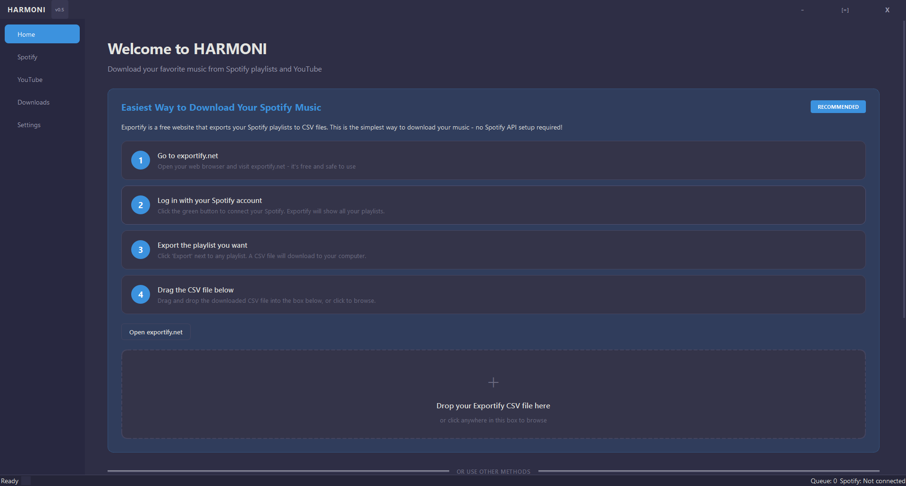
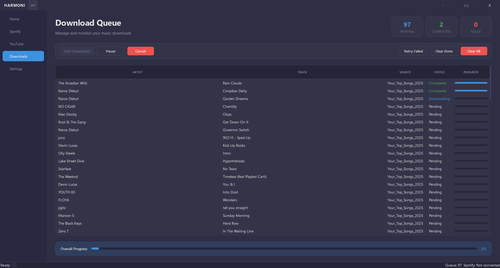
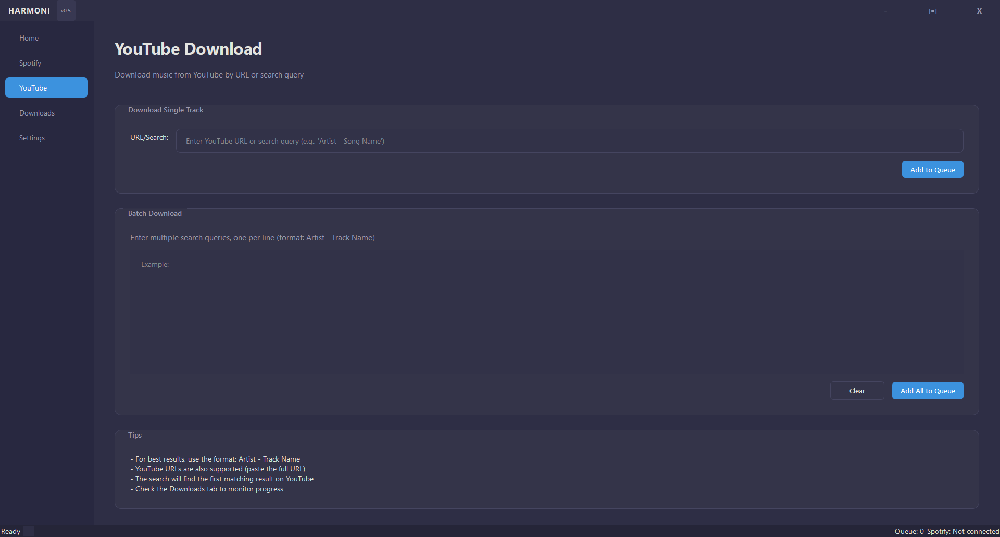
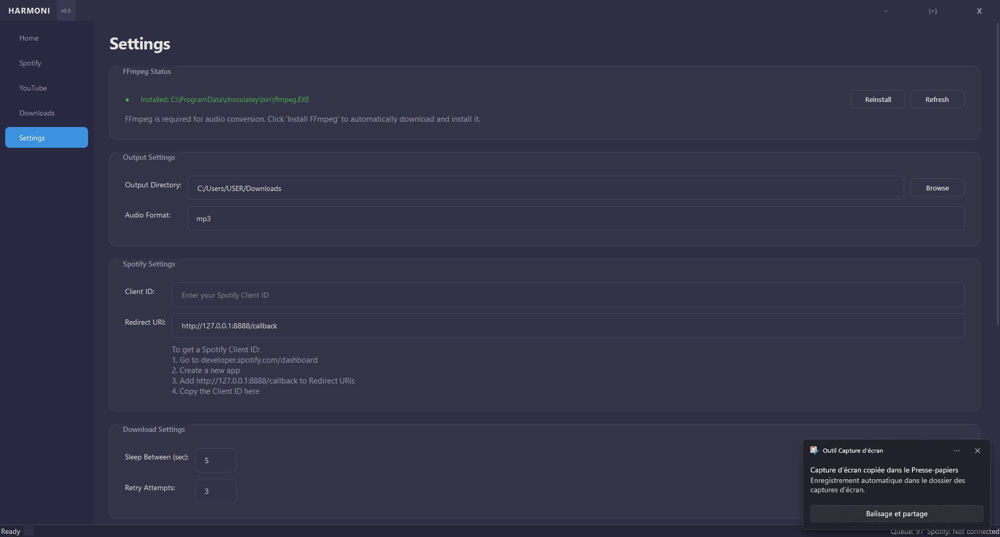

# HARMONI

A Python tool for downloading music from Spotify and YouTube using **yt-dlp**. Available as a standalone executable, desktop GUI application, or command-line interface.



## Features

- **Desktop GUI** - Modern graphical interface with drag-and-drop Exportify support
- **Spotify Integration** - Download from your playlists and liked songs via OAuth
- **YouTube Downloads** - Download from links or search by artist/song
- **Batch Downloads** - Download entire playlists with concurrent processing
- **Exportify Support** - Import playlists from CSV exports (easiest method!)
- **Metadata Embedding** - Automatic ID3 tagging for MP3 files
- **Library Management** - Duplicate detection, cleanup, and organization

## Installation Options

### Option 1: Standalone Executable (Easiest)

Download `HARMONI.exe` from the [Releases](https://github.com/Ssenseii/spotify-yt-dlp-downloader/releases) page. No Python installation required.

See [Standalone Guide](docs/guides/standalone.md) for details.

### Option 2: Python Installation

```bash
# Clone and install
git clone https://github.com/Ssenseii/spotify-yt-dlp-downloader.git
cd spotify-yt-dlp-downloader
pip install -r requirements.txt

# Run the GUI
python gui_main.py

# Or run the CLI
python main.py
```

### Option 3: Docker

```bash
docker compose build
docker compose run --rm --service-ports spotify-yt-dlp-downloader
```

## Quick Start

### GUI (Recommended)

The easiest way to download your Spotify music:

1. Launch `HARMONI.exe` or run `python gui_main.py`
2. Go to [exportify.net](https://exportify.net) and log in with Spotify
3. Export your playlists as CSV files
4. Drag and drop the CSV into HARMONI

No Spotify API setup required!

### Command Line

```bash
python main.py
# or
./start.sh
```

See [CLI Guide](docs/guides/cli.md) for all available commands.

## Screenshots

| Home | Downloads |
|------|-----------|
|  |  |

| YouTube Search | Settings |
|----------------|----------|
|  |  |

## Requirements

- **Standalone EXE**: None (ffmpeg bundled)
- **Python version**: Python 3.9+ and ffmpeg

## Documentation

See the [docs/](docs/) folder for detailed guides:

- [Installation Guide](docs/guides/installation.md) - Full setup instructions
- [GUI Guide](docs/guides/gui.md) - Using the desktop application
- [CLI Guide](docs/guides/cli.md) - Command-line interface reference
- [Standalone Guide](docs/guides/standalone.md) - Using the executable
- [Spotify Setup](docs/guides/spotify-setup.md) - Connect your Spotify account
- [Configuration](docs/guides/configuration.md) - Settings reference
- [Docker](docs/guides/docker.md) - Container deployment

## License

MIT License - see [LICENSE](LICENSE) for details.

## Disclaimer

This tool is for **personal use only**. Respect copyright laws and YouTube's terms of service.
